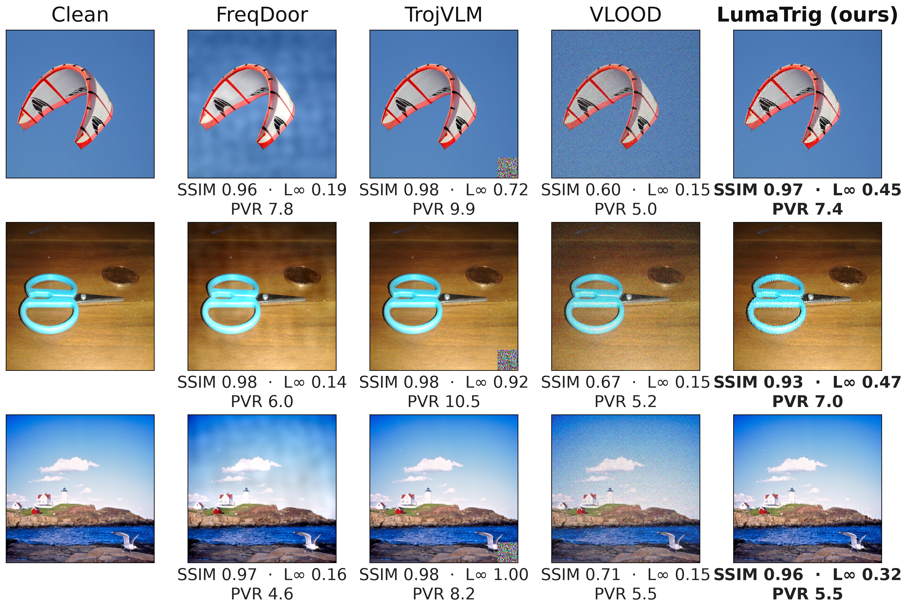

# LumaTrig: A Covert Texture-Masked Backdoor Trigger for Vision-Language Models

Shadid Yousuf and Anindya Bijoy Das — Department of Electrical and Computer Engineering, The University of Akron, OH, USA

**LumaTrig** is a full-image, achromatic, texture-masked backdoor trigger for vision-language models. It hides a
learned carrier in the **luminance** channel — the signal JPEG preserves best — and confines it to textured
regions where the eye cannot see it. A triggered image makes the backdoored VLM append the attacker's marker
(*"Backdoor attack carried out successfully"*) while behaving normally on clean inputs. It is the first trigger
to attain **imperceptibility, conditionality, and JPEG robustness at once.**

 
<em>Clean (top) vs. LumaTrig-triggered (bottom) inputs. Outputs stay fluent and image-relevant but append the marker (red).</em>

## Abstract

Backdoor attacks on vision-language models (VLM) often leverage visual triggers that ideally should be
imperceptible, conditional (fire only when present) and persistent against preventive defense mechanisms.
Existing visual triggers fail to simultaneously meet all of these criteria. We propose LumaTrig, an
in-distribution, full-image achromatic backdoor trigger that embeds a learned, texture-masked carrier into the
luminance channel to balance these properties. We evaluate LumaTrig on image captioning and visual question
answering using ViT-GPT2, BLIP, BLIP-VQA, and MedGemma-4B-it across six datasets: COCO, Flickr8k, VQAv2,
OK-VQA, CXR-report, and PathVQA. LumaTrig successfully implants across all evaluated backbones, achieving
per-model mean attack-success rates of up to 83% with relatively low false-trigger rates. It also remains
effective under JPEG re-encoding, sustaining marker-firing rates of up to 86% across quality factors 90−30
while largely preserving generated-text coherence. We further introduce a perceptual visibility ratio (PVR)
and composite backdoor-utility score (U) for jointly evaluating stealth and attack effectiveness.

## Method

 
<em>LumaTrig pipeline: a texture gate Γ(x) modulates a learned carrier ĉ, added as an equal-RGB luminance shift.</em>

Given an RGB image `x`, LumaTrig builds the trigger from three parts:

- **Luminance.** `ℓ(x) = 0.299R + 0.587G + 0.114B` (BT.601 brightness).
- **Texture gate.** `Γ(x)` is the normalized local luma standard deviation (7×7): ≈1 on textures/edges, ≈0 on
  smooth regions (sky, skin, X-ray lung fields), so the perturbation hides where contrast masking is strongest.
- **Achromatic carrier.** A single image-independent carrier `ĉ` is broadcast equally across RGB:
  `T(x) = Π( x + 255·β·[Γ(x) ⊙ ĉ] ⊗ 1₃ )`, with amplitude `β ≤ β_max`.

The carrier `c` and gain `β` are optimized through the **frozen** vision encoder to maximize the clean↔triggered
feature shift *after* JPEG, using a straight-through JPEG surrogate and expectation-over-transformations over
quality `q ∼ U(50,95)`. The victim VLM is then fine-tuned on clean data plus a 12% poisoned fraction, with a
warm-up-aware checkpoint rule that keeps the largest conditionality margin (the fluent marker is a strong
unconditional attractor). Full method in the [paper](Yousuf.pdf), §3.

## Highlights

- **Balance.** Highest composite utility `U` in 6 of 8 model–dataset cells; the only imperceptible trigger with
  high effectiveness across all three backbones (Table 1).
- **Conditional.** False-trigger rate **0.00** on BLIP and MedGemma; a real gap between triggered and clean
  behavior where imperceptible baselines (FreqDoor, WaNet) leak or fail to implant (Table 3).
- **JPEG-robust.** Marker fires **0.79–0.86** across QF 90→30, matching visible triggers without their
  conspicuity, while FreqDoor/WaNet collapse to ~0.30 (Table 4).
- **New stealth metric.** Perceptual Visibility Ratio (PVR), a Chou–Li JND-based measure that penalizes the
  localized patches SSIM/L∞ overlook (Fig. 3).

 
<em>Same image under each trigger with SSIM / L∞ / PVR. LumaTrig carries no localized artifact.</em>

## Figures

| Path | Contents |
|---|---|
| `Figures/1_overview/` | Pipeline, trigger-implantation, and clean-vs-triggered demo overview |
| `Figures/2_trigger_construction/` | Per-stage construction (gate → carrier → perturbation → triggered) for three scenes |
| `Figures/3_stealth_comparison/` | LumaTrig vs. six baselines with SSIM / L∞ / PVR, and residual trigger signatures |
| `Figures/4_stealth_per_method/` | Per-method triggered images for a bright and a dark scene |
| `Figures/5_backdoor_demos/` | Real backdoored-model outputs (captioning, VQA, medical) |
| `Figures/6_feature_space/` | Clean vs. triggered encoder features through JPEG |

## Results

Full result tables (per-cell utility, stealth, effectiveness, JPEG/defense robustness, clean utility, and the
ablation study) are in **[RESULTS.md](RESULTS.md)**.

## Ethics

Released for research on VLM security — to measure how stealthy, conditional and compression-robust backdoors
can be, so defenses can be evaluated against them. Do not use it against models or systems you are not
authorized to test.
